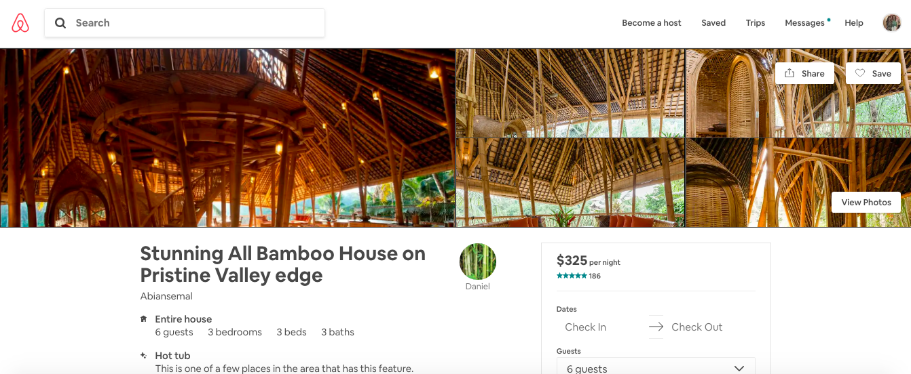

# Airbnb Bootstrap Lab
## The Goal
Once you know how to use Bootstrap's components, creating professional web interfaces is possible in a much shorter amount of time. Your job in this lab is to implement and modify Bootstrap components to recreate one of the most popular interfaces on the web -- Airbnb. 
## The Lab

1. Navigate to airbnb.com and choose "Stays." Choose your favorite home listing on Airbnb (see above for an example of a listing).
2. Recreate the look of the listing you chose by adding in Bootstrap components and modifying them to match the style of the page. Note: none of the elements need to be functional (i.e. no buttons will be clickable, the navbar links won't work, etc.) -- your goal is simply to recreate the look of the page. Start your work in index.html -- Bootstrap has already been linked, as has style.css. We recommend starting with the nav bar as your first element and working your way down from there!
